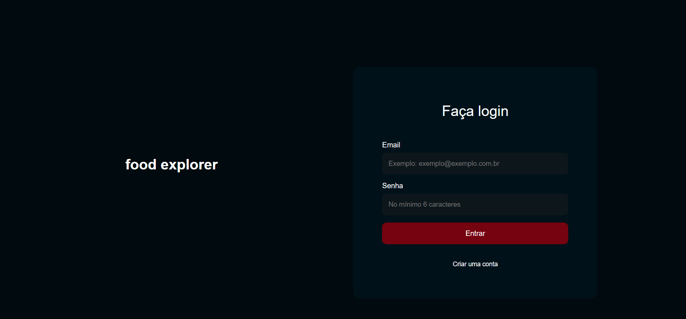

<h1 align="center"> Food Explorer </h1>
<p align="center">Consultar um cardápio digital para um restaurante fictício!</p>

<h4 align="center">Versão 1.0</h4>
<p align="center">
<a href="#sobre">Sobre</a>&nbsp;&nbsp;&nbsp;|&nbsp;&nbsp;&nbsp;
<a href="#telas">Telas</a>&nbsp;&nbsp;&nbsp;|&nbsp;&nbsp;&nbsp;
<a href="#tecnologias">Tecnologias</a>&nbsp;&nbsp;&nbsp;|&nbsp;&nbsp;&nbsp;
<a href="#layout">Layout</a>&nbsp;&nbsp;&nbsp;|&nbsp;&nbsp;&nbsp;
<a href="#instalação">Instalação</a>&nbsp;&nbsp;&nbsp;
<br>
<p align="center">



## Sobre

O Api Food Explorer é uma aplicação consulta de um cardápio digital para um restaurante fictício, conhecido como foodExplorer.!

Este projeto foi um desafio desenvolvido para uma avaliação técnica.

**OBS:** Esta é a versão Front-end do projeto.


## Telas
Esse projeto foi desenvolvido as seguintes telas:

- Tela de Cadastro de usuarios
- Tela de autenticação de usuarios e admin
- Tela de visualização de pratos, refeições e bebidas
- Tela cadastro de novos pratos, refeições e bebidas
- Tela edição de pratos, refeições e bebidas
- Tela de visualização das informações dos pratos, refeições e bebidas

[1.1]: http://i.imgur.com/tXSoThF.png (texto título)
## Tecnologias
Esse projeto foi desenvolvido com as seguintes tecnologias:

- Javascript
- React
- Vite
- Styled Components
- Axios
- Swiper
- Git e Github


## Layout

Link do layout usado no projeto:

- [Layout Figma](https://www.figma.com/file/TA9lm0BzTiebtxxD2MNAhV/food-explorer-v2-(Community)?type=design&node-id=201-1532&mode=design&t=zjEzwgL6qBDnPeGF-0)

## Instalação 

Para clonar e executar esta aplicação, você precisará do [Git](https://git-scm.com/). A partir de sua linha de comando:

```bash
# Clone este repositório
$ git clone git@github.com:BrunoBianchi13/food-explorer.git

# Entre no repositório
$ cd food-explorer

# Instale as package.json
$ npm install

# OBS: para logar como Admin, Email: "Admin" Senha: "123"
```


## 💻 Projeto


- [Acesse ao deploy api do projeto](https://foodexplorer-api-3zw2.onrender.com)
- [Acesse ao deploy Front-end do projeto](https://foodexplorerbrunob.netlify.app/)
---

<p align="center">
Feito by Bruno Bianchi
</p>
